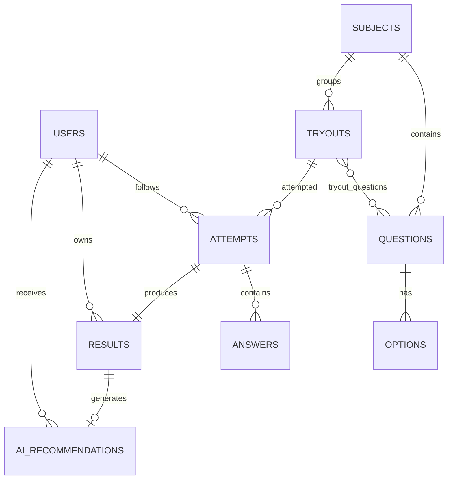

# ERD aRBiPi

```mermaid
erDiagram
    USERS ||--o{ ATTEMPTS : follows
    USERS ||--o{ RESULTS : owns
    USERS ||--o{ AI_RECOMMENDATIONS : receives
    SUBJECTS ||--o{ QUESTIONS : contains
    SUBJECTS ||--o{ TRYOUTS : groups
    QUESTIONS ||--|{ OPTIONS : has
    TRYOUTS }o--o{ QUESTIONS : tryout_questions
    TRYOUTS ||--o{ ATTEMPTS : attempted
    ATTEMPTS ||--o{ ANSWERS : contains
    ATTEMPTS ||--|| RESULTS : produces
    RESULTS ||--o| AI_RECOMMENDATIONS : generates
```
